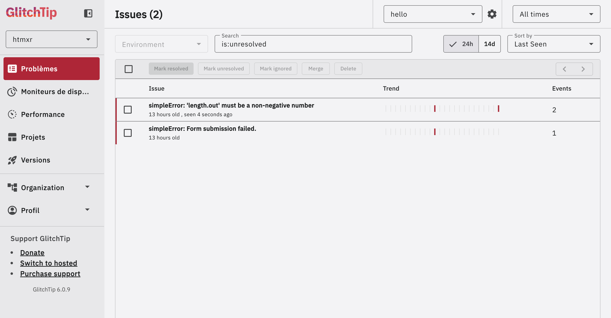
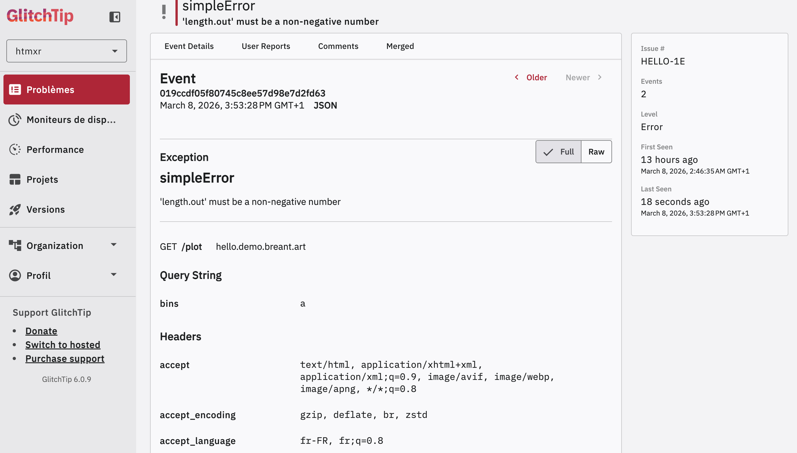
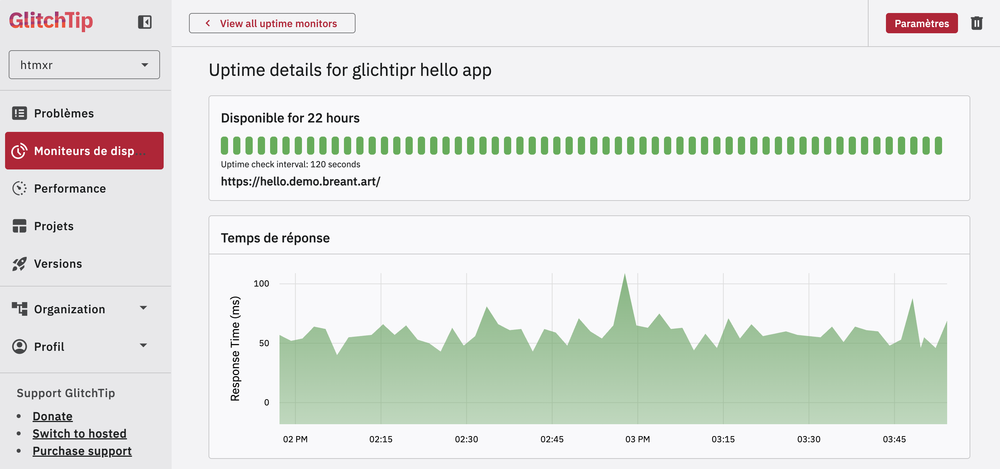

<!-- README.md is generated from README.Rmd. Please edit that file -->

# glitchtipr <a href="https://hyperverse-r.github.io/glitchtipr/"></a>

<!-- badges: start -->


[](https://lifecycle.r-lib.org/articles/stages.html#experimental)
[](https://github.com/hyperverse-r/glitchtipr/actions/workflows/R-CMD-check.yaml)
[](https://app.codecov.io/gh/hyperverse-r/glitchtipr)
<!-- badges: end -->

> Capture, report, and contextualise R errors in production — with
> [GlitchTip](https://glitchtip.com) or any Sentry-compatible platform.

When an R error occurs in a production app, it disappears silently
unless you’ve set up error tracking. `{glitchtipr}` sends errors to
GlitchTip with full context (endpoint, query string, HTTP headers) so
you can find and fix them without guessing.

## Installation

``` r
# Install the development version from GitHub:
pak::pak("hyperverse-r/glitchtipr")
```

## Example — plumber2

`{glitchtipr}` ships with a `@capture` plumber2 tag. One annotation
above a route — that’s all it takes.

### Setup

``` r
library(glitchtipr)

gt <- gt_connect()  # reads GLITCHTIP_DSN from environment
```

### Protecting a route

``` r
#* @capture
#* @get /plot
#* @parser none
#* @serializer none
function(request, query) {
  generate_plot(query$bins %||% 30)
}
```

`@capture` wraps the handler automatically. If `generate_plot()` throws,
the error is reported to GlitchTip with full context — then re-raised so
plumber2 handles it normally.

In the example above, passing `bins = a` (a non-numeric value) triggers
a `simpleError`. GlitchTip captures it, groups it with previous
occurrences, and shows exactly what happened.

<p align="center">

</p>

Errors are grouped by type and message. Each one shows its occurrence
count and when it was last seen — useful for spotting regressions after
a deploy.

Clicking an issue reveals the full event detail: the endpoint that
failed (`GET /plot`), the query string that triggered it (`bins = a`),
and the sanitised request headers.

<p align="center">

</p>

No log digging. No reproducing in the dark. The context is right there.

### Uptime monitoring

GlitchTip also provides uptime monitoring. The same dashboard that
tracks your errors tells you whether your app is up.

<p align="center">

</p>

### How it works

Connect once, wrap once, and you’re done:

``` r
gt <- gt_connect()   # reads GLITCHTIP_DSN — inactive if not set

gt_capture(gt, {
  # your code here — errors are reported then re-raised
})
```

If no DSN is configured, `gt_connect()` returns an inactive connection
and `gt_capture()` is a zero-overhead no-op. Safe in development without
a GlitchTip instance.

## Works with Shiny too

`gt_capture()` is framework-agnostic. In Shiny, use it directly inside
`renderPlot()`, `observeEvent()`, or any reactive context.

``` r
library(shiny)
library(glitchtipr)

gt <- gt_connect()

server <- function(input, output, session) {
  # In render functions, Shiny catches the re-raised error and displays it
  # in the output — no extra handling needed.
  output$plot <- renderPlot({
    gt_capture(gt, {
      x <- faithful[, 2]
      bins <- seq(min(x), max(x), length.out = input$bins + 1)
      hist(x, breaks = bins, col = "darkgray", border = "white")
    })
  })

  # In observers, wrap with tryCatch to prevent the session from crashing.
  # gt_capture() has already reported the error before it propagates.
  observeEvent(input$crash, {
    tryCatch(
      gt_capture(gt, {
        stop("Something went wrong.")
      }),
      error = function(e) invisible(NULL)
    )
  })
}
```

## Design philosophy

-   **Errors propagate** — `gt_capture()` uses `withCallingHandlers()`,
    not `tryCatch()`. Errors are reported but always re-raised. In
    plumber2 and Shiny render functions this is handled automatically.
    In Shiny observers, wrap with `tryCatch()` after `gt_capture()` to
    prevent the session from crashing.

-   **Silent when unconfigured** — no DSN means no connection, which
    means `gt_capture()` is a pure no-op. No errors, no overhead in
    development.

-   **Minimal surface** — two functions: `gt_connect()` and
    `gt_capture()`. One plumber2 tag: `@capture`. That’s the entire API.

-   **Self-hostable** — built for [GlitchTip](https://glitchtip.com)
    (open source, Sentry-compatible) but works with any platform that
    implements the Sentry store API.

-   **Context-aware** — the report includes the endpoint, query string,
    and sanitised headers (`Authorization` and `Cookie` are stripped
    automatically).

## Code of Conduct

Please note that the glitchtipr project is released with a [Contributor
Code of
Conduct](https://hyperverse-r.github.io/glitchtipr/CODE_OF_CONDUCT.html).
By contributing to this project, you agree to abide by its terms.
